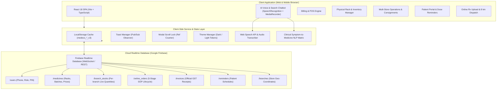
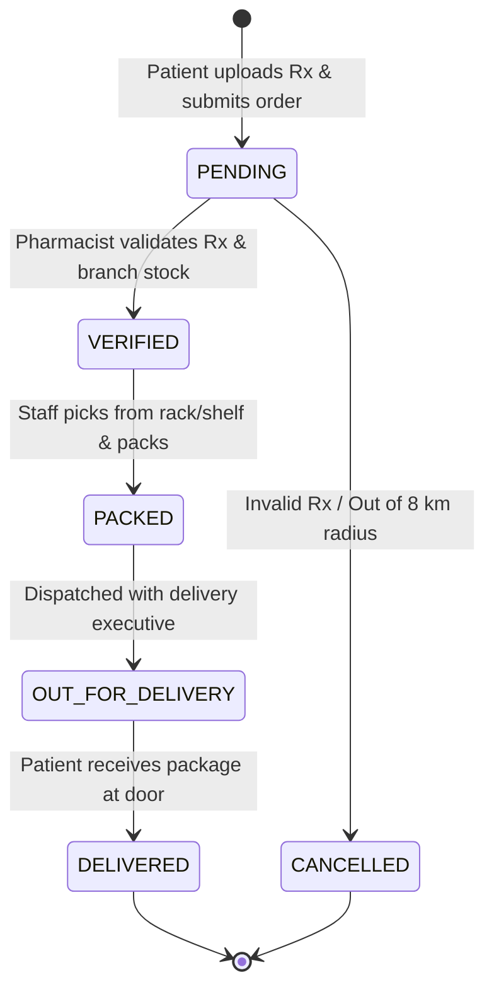

# medEco Healthcare Systems - System Architecture & Technical Specifications

**Version**: 3.2.0  
**Status**: Production-Ready  
**Stack**: React 18 • TypeScript 5 • Vite • Tailwind CSS • Firebase Realtime Database • Web Speech API • Canvas Confetti  
**Author**: Antigravity AI Engineering Team  

---

## 1. Executive Overview

**medEco** is a multi-branch digital pharmacy and inventory operating system designed for urban retail pharmacy networks. It unites point-of-sale (POS) billing, physical shelf/rack location indexing, multi-store stock rebalancing, customer order dispatch within an 8 km geofenced radius, medicine dosage reminders, and a voice-enabled AI search assistant into a cohesive, responsive web platform.

---

## 2. High-Level Architecture Diagram



---

## 3. Core Subsystems & Components

### 3.1. Voice & Text AI Search Chatbot (`SearchChatbot.tsx`)
- **Activation Gate**: Strictly concealed until a user is authenticated (`session !== null`).
- **Multi-Modal Input Modes**:
  1. **Live Microphone**: Integrates browser Web Speech API (`SpeechRecognition` / `webkitSpeechRecognition`) tuned to `en-IN` (Indian English accent and pharmaceutical terminology).
  2. **Voice Memo Recorder**: Employs `navigator.mediaDevices.getUserMedia` and `MediaRecorder` to record audio notes in WebM format.
  3. **Audio File Upload**: Accepts pre-recorded `.mp3`, `.wav`, `.m4a`, and `.webm` voice files.
  4. **Text Symptom Filterization**: Natural language input with real-time suggestion chips.
- **Clinical Symptom-to-Medicine Inference Engine**:
  - Maps 12+ primary illness profiles (fever, migraine, cold/cough, acidity/GERD, abdominal spasms, diarrhea, diabetes, hypertension, allergies, infections, vitamin deficiencies) directly to active generic salts and commercial trade names.
  - Automatically correlates recommendations with real-time inventory from Firebase RTDB.
  - Formats results into interactive cards displaying dosage guidelines, meal relation (e.g. *Empty Stomach*, *After Food*), MRP, cross-branch live stock, and 1-tap **"Add to Cart / Bill"** buttons.
- **Conversational Ordering & Follow-Up Flow**:
  - Following tablet recommendations, the AI directly asks the customer if they wish to create an online prescription order.
  - Interactive Action Chips:
    - **"Proceed to Online Order"**: Pre-fills suggested tablets and clinical notes into `OnlineOrderModal` and opens it.
    - **"Include Existing Illness"**: Prompts the customer for chronic conditions or secondary symptoms to ensure safe supportive therapy.
    - **"Need Pharmacist Help"**: Instant helpline numbers and direct phone lines to all 4 nearest branches.
    - **"Clear Chat"** / **"Close Chat"** buttons for quick conversation lifecycle control.
- **WhatsApp Order Confirmation & Deep-Link Live Tracking**:
  - Upon order placement, the chatbot receives the confirmed order and renders a WhatsApp dispatch card with:
    - **Send to Customer Mobile** (`wa.me/91${customerMobile}?text=...`): itemized receipt, order total, delivery hub, and live tracking deep-link.
    - **Alert Store Pharmacist** (`wa.me/91${branchPhone}?text=...`): instantly notifies dispensary staff with item breakdown and link to active SOP manager.
    - **In-App Live Tracking**: Direct navigation button to view the active order on the 5-stage SOP timeline (`/?track=${order.id}&tab=customer_history`).
- **Security & Privacy Boundary**:
  - **For Patients**: Internal warehouse physical shelf numbers, rack rows, and bin boxes are **strictly masked**.
  - **For Owners**: Physical storage coordinates (e.g. *Rack A, Shelf 2 [Box-04]*), cost prices, and quick rack navigation buttons are exposed.

---

### 3.2. Authentication & Data Privacy Architecture (`AuthModal.tsx` & `firebase.ts`)
- **Zero Hardcoded Credentials**: Authentication relies on verified records in Firebase Realtime Database under `/users/{mobileNumber}`.
- **Patient Authentication**: One mobile number = one patient account. First-time registration captures patient name, address, zone, and a secure 4-digit PIN.
- **Owner Authentication**: Authenticated via owner mobile number and PIN stored securely in Firebase RTDB.
- **Customer Directory & Remote Assistance**: Store owners have administrative access to view registered customer mobile numbers and assist patients who forgot their PIN by updating `/users/{mobile}/pin` in real time with instant client cache invalidation.

---

### 3.3. Multi-Store Network & 8 km Geofencing (`MultiStoreDashboard.tsx`)
- **Store Network**:
  1. **Warangal Main Branch** (`pharm-warangal-main`): MGM Hospital Road (17.9784° N, 79.6015° E)
  2. **Hanamkonda Chowrasta** (`pharm-hanamkonda`): 80 Feet Road (18.0125° N, 79.5658° E)
  3. **Kazipet Junction** (`pharm-kazipet`): Station Road (17.9812° N, 79.5214° E)
  4. **Subedari Branch** (`pharm-subedari`): Collectorate Complex (18.0051° N, 79.5752° E)
- **8 km Express Delivery Radius Geofencing**:
  - Uses the spherical **Haversine formula** to compute exact geodesic distance between customer coordinates and pharmacy stores:
    $$d = 2R \arcsin\left(\sqrt{\sin^2\left(\frac{\Delta \phi}{2}\right) + \cos(\phi_1)\cos(\phi_2)\sin^2\left(\frac{\Delta \lambda}{2}\right)}\right)$$
  - Where $R = 6371\text{ km}$.
  - Online orders are permitted **only if distance $\le 8.0\text{ km}$** from the nearest branch.
- **Inter-Branch Stock Balancing & Consignments**:
  - Tracks live quantities per branch (`/branch_stocks/{branchId}_{medicineId}`).
  - Supports supplier consignment check-ins and cross-branch stock transfers.

---

### 3.4. POS Billing & Invoicing Engine (`BillingPOS.tsx` & `ReceiptModal.tsx`)
- **Real-Time Barcode & Quick Search**: Searches medicines across name, generic composition, and physical rack index.
- **Dynamic Cart Calculations**:
  - CGST / SGST breakdown per item based on statutory GST slabs (5%, 12%, 18%).
  - Configurable discounts (preset percentages or flat amounts).
  - Multiple payment tender modes (Cash, UPI, Card, Credit).
- **Physical Rack Traceability**: Records exact shelf location onto the invoice item so dispensary staff can instantly fetch the medicine without warehouse delays.
- **GST Tax Invoice & WhatsApp Integration**: Generates printable GST-compliant receipts and provides 1-tap WhatsApp sharing with formatted itemized summaries.

---

### 3.5. Background Scroll Lock, Fixed Header & Mobile Viewport Protection Subsystems
- **Fixed Top Header & Body-Only Scrolling (`Navbar.tsx`, `OnlineOrderModal.tsx`, `index.css`)**:
  - **Main Navigation Header Lock**: Uses `overflow-x: clip;` on `html, body` (CSS Overflow Module Level 3) instead of `overflow-x: hidden;`. This eliminates scroll container interference and guarantees `sticky top-0 z-50` on `<header>` in `Navbar.tsx` remains firmly locked at the top of the viewport across all browsers (Chromium, Safari, Firefox). The top header never scrolls away; only the page body (`<main>`) scrolls.
  - **Modal Fixed Header Architecture (`OnlineOrderModal.tsx`, `ReceiptModal.tsx`, `UserManualModal.tsx`)**:
    - Outer modal overlay is set to `overflow-hidden flex items-center justify-center` preventing outer wrapper scrolling.
    - Modal dialog enforces `max-h-[92vh] flex flex-col`.
    - Modal Header is pinned with `shrink-0 sticky top-0 z-30 shadow-xs` — the top header never scrolls out of view.
    - Modal Body has `flex-1 overflow-y-auto overscroll-contain` — ONLY the body content scrolls smoothly.
    - Modal Action Bar (Submit/Cancel) is pinned with `shrink-0 sticky bottom-0 z-20` with frosted glass backdrop blur.
- **Prescription Upload & Exact Suggested Tablets Preservation (`OnlineOrderModal.tsx`)**:
  - **Zero Arbitrary Default Tablets**: Uploading a prescription photo never overrides the patient's existing selection or injects dummy hardcoded tablets (e.g. Dolo 650, Pan 40, Cetzine 10).
  - **Exact Suggested Tablet Preservation**: If the patient was referred from the AI Chatbot or Medicine Finder with suggested tablets, those exact medicines are preserved and attached to the uploaded prescription.
  - **Strict Existing Tablet Cost Accounting**: Estimated total cost is strictly calculated from active items in `orderItems` (`orderItems.reduce((acc, it) => acc + it.quantity * it.unitPrice, 0)`). When only an Rx image is uploaded without prior tablets, the estimated total is strictly `₹0.00 (Pending Rx Verification)`, avoiding misleading or inflated default billing totals.
- **Dual-Layer Scroll Lock Engine (`modalLock.ts`)**:
  - Employs a module-scoped reference counter (`activeModalsCounter`) handling nested and concurrent modals safely.
  - **Dual-Layer Containment**: Freezes both `document.body` and `document.documentElement` with `overflow = 'hidden'` and `overscrollBehavior = 'contain'`.
  - **Mobile Touchmove Propagation Shield**: Attaches an active `touchmove` event interceptor that cancels touch drag events originating outside `.overflow-y-auto`, `.overflow-auto`, or `[data-modal-scrollable="true"]` containers. Completely prevents background page elastic rubberbanding on iOS Safari and Android Chrome while preserving smooth touch scrolling inside modal dialog bodies.
  - **Universal Coverage**: Synchronously enforced across all modal and interactive overlay surfaces:
    1. `OnlineOrderModal`: Rx prescription upload & 8 km delivery allocation
    2. `SearchChatbot`: Expanded voice/audio/text AI search assistant (`useModalScrollLock(isOpen && !isMinimized)`)
    3. `AuthModal`: Patient mobile login & owner authentication
    4. `ReceiptModal`: Official GST tax invoice printable receipt
    5. `UserManualModal`: Role-separated patient & owner operations manuals
    6. `OrderNotificationPopup`: Live store incoming prescription alert
    7. `MultiStoreDashboard`: Inter-branch stock transfer & replenishment modal
    8. `InventoryManager`: Master medicine catalog & rack location modal
- **Chatbot Mobile Architecture**:
  - Features a full-screen-ready mobile layout with a dedicated mobile backdrop overlay (`fixed inset-0 z-45 bg-slate-900/60 md:hidden`) that captures background touches and allows tap-to-minimize.
  - Floating launcher button is anchored at `bottom-20 right-4` on mobile viewports to prevent collision with the sticky bottom navigation bar.
- **Mobile Navigation & Viewport Protection (`Navbar.tsx` & `App.tsx`)**:
  - **Single Mobile Logout**: Logout is strictly hidden from the top navbar and customer profile card on mobile viewports (`hidden md:flex`), presenting a clean, single logout action in the sticky bottom navigation bar.
  - **Single-Line Tier 2 Pill Navigation**: Employs `whitespace-nowrap shrink-0` across secondary navigation buttons with horizontal scroll (`overflow-x-auto no-scrollbar md:flex-wrap`), preventing awkward multi-line text wrapping on mobile devices while keeping desktop web CSS 100% intact.
- **Backdrop Click Guard**:
  - Modal overlay containers enforce `onClick={(e) => e.stopPropagation()}` to prevent accidental dismissal on background clicks. Modals close only via explicit buttons (Cancel, Close '✕', or Submit).
- **Toast System (`toast.ts` & `ToastContainer.tsx`)**:
  - Pure TypeScript Pub/Sub observer pattern without external library overhead.
  - Dispatches `success`, `info`, `warning`, and `error` notifications at `z-[99999]`.

---

## 4. Firebase Realtime Database Data Model

```
mediaclinfo-default-rtdb
│
├── /users/{mobileNumber}
│   ├── role: "customer" | "owner"
│   ├── mobileNumber: string (10 digits)
│   ├── name: string
│   ├── pin: string (4-digit security PIN)
│   ├── createdAt: ISO timestamp
│   └── lastLoginAt: ISO timestamp
│
├── /medicines/{medicineId}
│   ├── id: string
│   ├── name: string
│   ├── genericName: string
│   ├── brand: string
│   ├── category: "Tablets" | "Syrups" | "Capsules" | ...
│   ├── dosage: string (e.g. "650 mg")
│   ├── stripSize: string
│   ├── unitPrice: number (MRP)
│   ├── costPrice: number
│   ├── stock: number (Consolidated units)
│   ├── minStockAlert: number
│   ├── batchNumber: string
│   ├── expiryDate: YYYY-MM-DD
│   ├── gstRate: number (5, 12, 18)
│   ├── rackLocation: { rackId, shelfNumber, boxNumber }
│   └── requiresPrescription: boolean
│
├── /branch_stocks/{branchId_medicineId}
│   ├── branchId: string
│   ├── medicineId: string
│   ├── stock: number
│   └── minStockAlert: number
│
├── /online_orders/{orderId}
│   ├── orderNumber: string
│   ├── customerMobile: string
│   ├── customerName: string
│   ├── pharmacyId: string
│   ├── pharmacyName: string
│   ├── address: string
│   ├── geoCoordinates: { latitude, longitude }
│   ├── prescriptionImageUrl: string
│   ├── items: Array<{ medicineId, medicineName, quantity, unitPrice, rackInfo }>
│   ├── estimatedTotal: number
│   ├── status: "PENDING" | "VERIFIED" | "PACKED" | "OUT_FOR_DELIVERY" | "DELIVERED"
│   └── createdAt: ISO timestamp
│
├── /invoices/{invoiceId}
│   ├── invoiceNumber: string
│   ├── customerMobile: string
│   ├── customerName: string
│   ├── branchId: string
│   ├── items: Array<InvoiceItem>
│   ├── subtotal: number
│   ├── discountAmount: number
│   ├── totalGst: number
│   ├── grandTotal: number
│   └── paymentMode: "Cash" | "UPI" | "Card" | "Credit"
│
└── /reminders/{reminderId}
    ├── customerMobile: string
    ├── medicineName: string
    ├── dosage: string
    ├── timings: Array<"Morning" | "Afternoon" | "Evening" | "Night">
    ├── mealRelation: "Before Food" | "After Food" | "Empty Stomach"
    └── isActive: boolean
```

---

## 5. Standard Operating Procedures (SOP) Order Lifecycle



---

## 6. Directory Structure

```
medEco/
├── .agents/
│   └── skills/                         # Antigravity operational skill guides
│       ├── medeco-search-chatbot/
│       ├── medeco-billing-pos/
│       ├── medeco-inventory-manager/
│       ├── medeco-medicine-finder/
│       ├── medeco-customer-directory/
│       ├── medeco-multistore-dashboard/
│       ├── medeco-online-order-modal/
│       └── medeco-rack-layout/
├── src/
│   ├── components/
│   │   ├── AuthModal.tsx               # Unified secure login & registration
│   │   ├── BillingPOS.tsx              # Quick barcode POS & cart calculation
│   │   ├── CustomerDirectory.tsx       # Branch-level patient PIN manager
│   │   ├── CustomerPortal.tsx          # Patient profile, orders & history
│   │   ├── GoogleMapViewer.tsx         # Interactive store & delivery radius map
│   │   ├── InventoryManager.tsx        # Physical shelf & master inventory
│   │   ├── InvoiceHistory.tsx          # Sales metric analytics & receipts
│   │   ├── MedicineFinder.tsx          # Multi-criteria medicine search
│   │   ├── MultiStoreDashboard.tsx     # Consignments & 4-branch stock manager
│   │   ├── Navbar.tsx                  # Responsive 2-tier navigation & theme
│   │   ├── OnlineOrderModal.tsx        # Rx prescription upload & 8 km geofence
│   │   ├── OrderNotificationPopup.tsx  # Live branch incoming order alert
│   │   ├── RackLayoutView.tsx          # Visual pharmacy shelf organizer
│   │   ├── ReceiptModal.tsx            # GST tax invoice & print format
│   │   ├── ReminderManager.tsx         # Automated medicine dose scheduler
│   │   ├── SearchChatbot.tsx           # Voice/audio AI tablet recommender
│   │   ├── ThemeToggle.tsx             # Smooth dark/light mode toggle
│   │   └── ToastContainer.tsx          # Reactive floating toast alerts
│   ├── services/
│   │   ├── firebase.ts                 # Pure RTDB sync & data access layer
│   │   ├── modalLock.ts                # Background scroll locking hook
│   │   ├── theme.ts                    # Dark mode theme manager
│   │   └── toast.ts                    # Zero-dependency toast observer
│   ├── types/
│   │   └── index.ts                    # Complete TypeScript definitions
│   ├── App.tsx                         # Core application controller
│   ├── index.css                       # Design tokens & print styles
│   └── main.tsx                        # Application entry point
├── architecture.md                     # Technical system architecture (this file)
└── package.json                        # Dependencies & scripts
```
